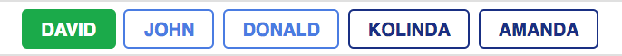
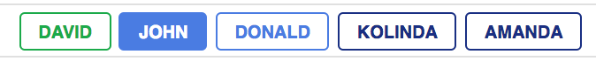
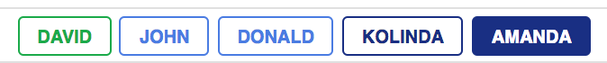

# Userswitch

[](https://badge.fury.io/rb/userswitch)

Userswitch is a Rails plugin for switching between commonly used roles and users. It's particularly useful for development and staging environments when you often need to switch between various accounts. It saves you from the hassle of logging in or out.

## Example

By default, the gem will output a chain of buttons as follows



By clicking on a button, your Rails app will switch to a different user, that is, your session will change to that of a different account and save you the time you might otherwise spend clicking on logout links and filling in forms to log as a different user.



Different roles can have different colors so as to be more noticeable.



## How to install

Add it to your app's Gemfile and run bundle
```ruby
gem "userswitch"
```
or install it manually
```ruby
gem install userswitch
```

## How to use

Inside of your template/view, you can call users with (showing only users with negative id):

``` Userswitch.users.html_safe  ```

The above command will generate the required HTML output to make the switching work.
